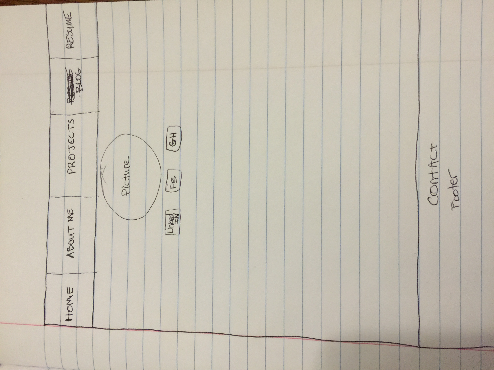
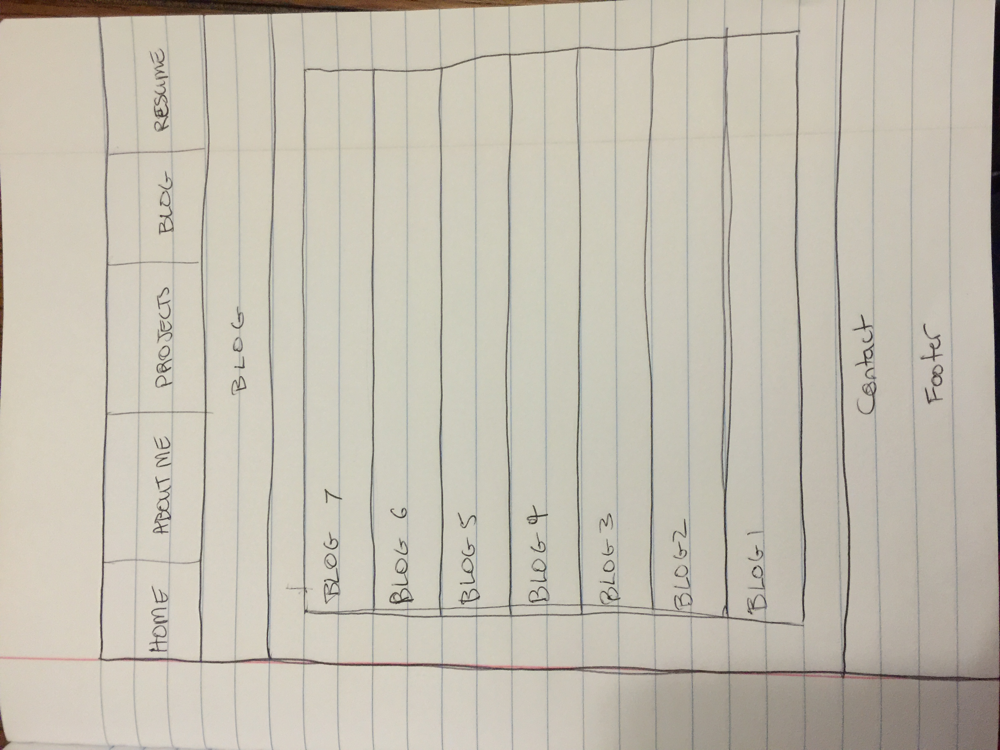

##2.4 Reflection

####What is a wireframe?

A wireframe is an outline that can act as a three-dimensional model for which functional elements of a website are recognized. This is part of the planning and design process to figure out functionality and structure.

####What are the benefits of wireframing?

The benefits of wireframing include testing iterations of layouts as well as navigation. It makes it easier to see what elements might need to be interactive and really the overall effectiveness of the layout. When thinking of wireframing, it's really thinking about it from a design perspective. How will this best suite the user? Refining the wireframe until you feel good with the layout can make the design process much easier.

####Did you enjoy wireframing your site?

I did enjoy wireframing my site, but I think I can be even more robust with it. When I was younger I loved to sketch. I feel like I will feel it's signifigance as I get further along. Just thinking about the design of a site is interesting. You want it to be functional but interesting enough that someone looks through the site.

####Did you revise your wireframe or stick with your first idea?

I had to revise it a few times. I just didn't know what I wanted or how I wanted it at first. And I'm still not 100% confident with it, but it's a start and I will build off of it.

####What questions did you ask during this challenge? What resources did you find to help you answer them?

I didn't really ask any questions regarding this challenge because it was fairly similar to the last one, but it made me think a lot more about design and functionality being united. It's like using both parts of your brain at the same time. I did google a bit about wireframing tools. I ended up just drawing mine out, but I will find one that I like eventually.

####Which parts of the challenge did you enjoy and which parts did you find tedious?

I honestly enjoyed it all. It takes a while to get through the material and really undestanding what wireframing is and how granular one can be when doing it.