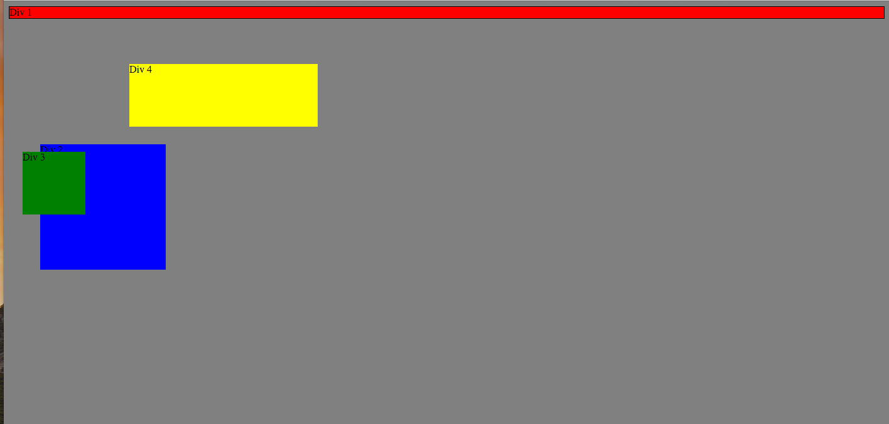
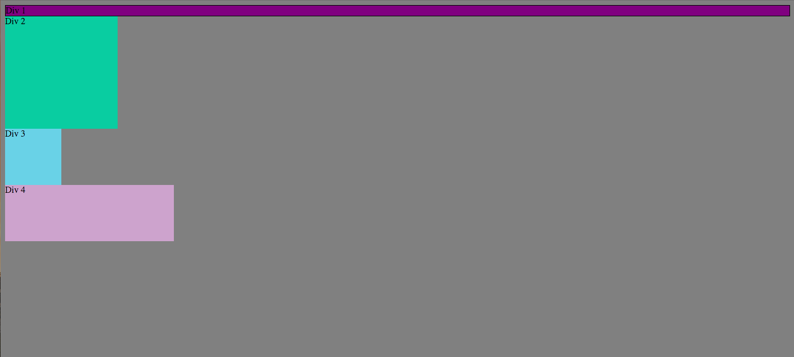
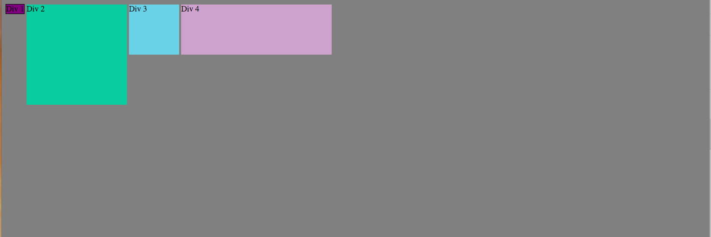
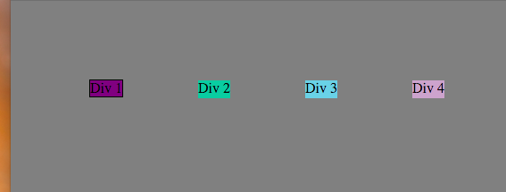
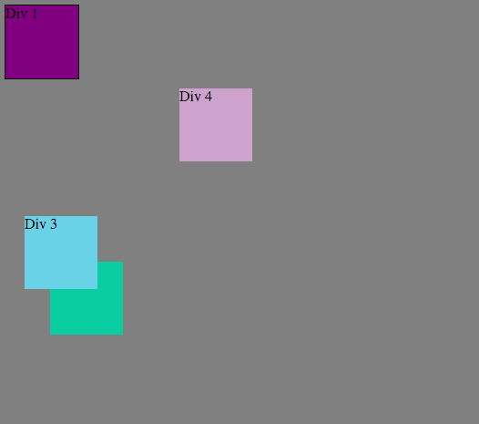
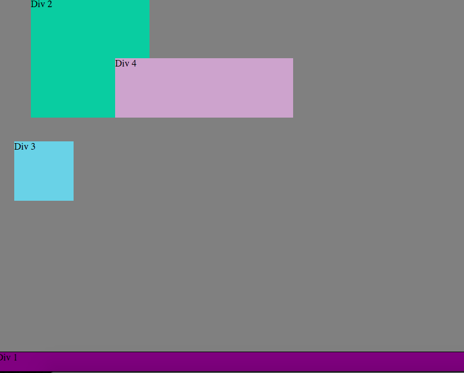
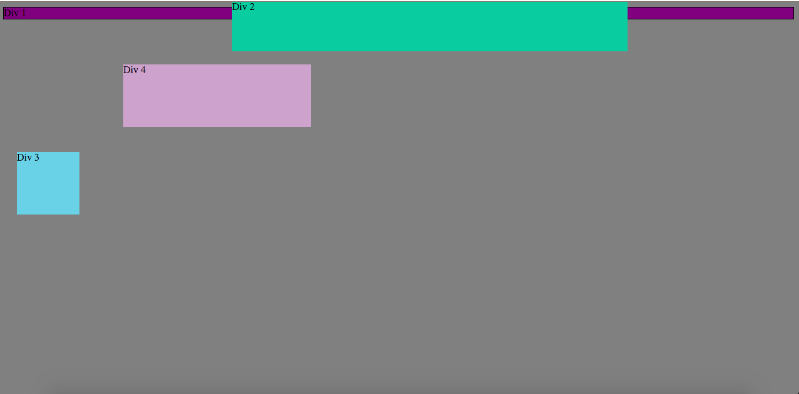
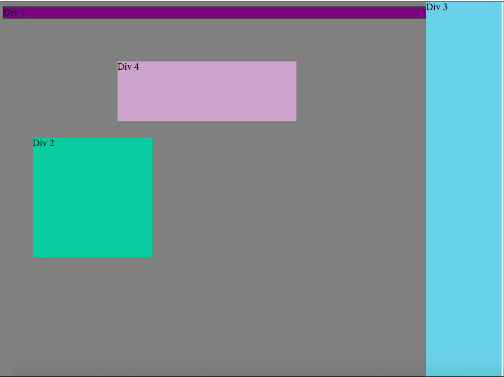
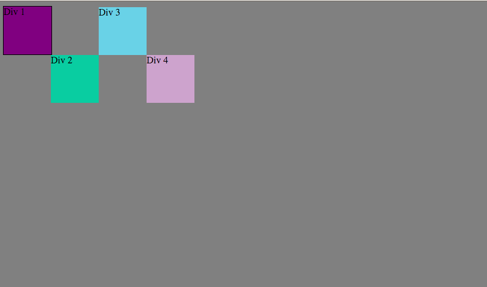

###How can you use Chrome's DevTools inspector to help you format or position elements?

You can use Chrome's DevTools inspector to help with formatting and positioning elements by quickly viewing sections of code, various elements, and the ability to quickly play with code and see it change in real-time.

###How can you resize elements on the DOM using CSS?

You can adjust the height and width properties in CSS on the DOM to resize elements. It shows you happening in real-time as you enter the code.

###What are the differences between absolute, fixed, static, and relative positioning? Which did you find easiest to use? Which was most difficult?

Absolute positioning allows you to place an element anywhere you'd like to on the page. You can utilize top, right, left, and bottom  to set the location. At the same time, it removes it from the flow of other elements on the page and doesn't affect other elements.

Fixed positioning makes an element stay relative to the page as you scroll, meaning it will be in browswer window no matter what. It's a rare element to use.

Static is the default for every element in general. This means the element will be on the page as it normally is.

Relative positioning puts the element relative to itself. You'd use top, bottom, left, or right as desired and it would move the opposite from that value you set. This can be confusing.

I found absolute to be the easiest to use, but relative came in handy as well.

###What are the differences between margin, border, and padding?

Padding is the space between the content and the border. Margin is the space outside the border.
Padding can adjust how far or close your elements content are to the border. Margin is the outside and how far the element is from other elements.

###What was your impression of this challenge overall? (love, hate, and why?)

This challenge was fairly simple. Nothing was perfect on the first time, but after trial and error and discussing with my pair, we were able to get through each challenge with relative ease.