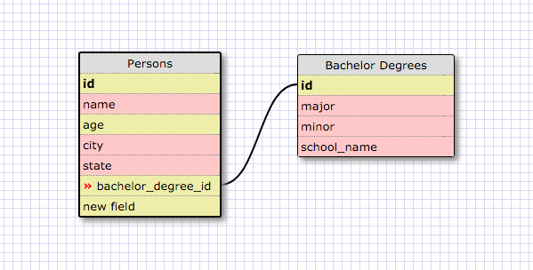
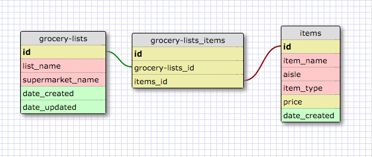

This is a one-to-one relationship because I could put bachelor degree as a column for Persons, but it can also have its own. Only one person will have one bachelors degree. It can also be NULL inside of the table.

####What is a one-to-one database?

A one-to-one database is where two tables exist and have a single relationship to one another. They are a pair. Each row in one database table is linked to 1 other row in another table.

####When would you use a one-to-one database? (Think generally, not in terms of the example you created).

You would use a one-to-one database for storing a users credit card information, one list being the customer, and the other being the number. There's only going to be one unique number per customer name.

####What is a many-to-many database?

A many-to-many database is when both tables or entities relate to eachother in multiple ways. Items from one table match items in another table.

####When would you use a many-to-many database? (Think generally, not in terms of the example you created).

Think of songs and radio-stations. A song is played on multiple radio-stations, and a radio-station plays many songs.

####What is confusing about database schemas? What makes sense?

Nothing is really too confusing so far. It's pretty straight forward.